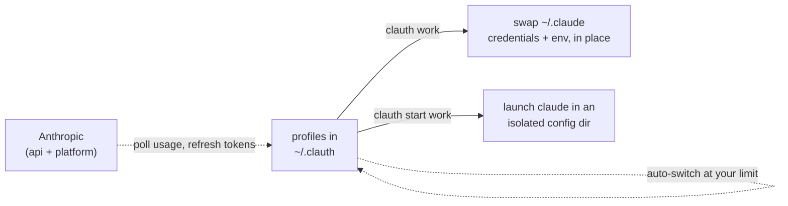

<p align="center">
    
</p>

<h1 align="center">Claude Code multi-account manager & MCP Plugin</h1>

<p align="center">
  <a href="https://github.com/uwuclxdy/clauth/actions/workflows/release.yml"></a>
  <a href="https://crates.io/crates/clauth"></a>
  <a href="https://github.com/uwuclxdy/clauth/releases"></a>
  
  <a href="LICENSE"></a>
</p>

<p align="center">
  <a href="#features">Features</a> ·
  <a href="#how-it-works">How it works</a> ·
  <a href="#install">Install</a> ·
  <a href="#quickstart">Quickstart</a> ·
  <a href="#keys">Keys</a> ·
  <a href="#configuration">Configuration</a> ·
  <a href="#claude-code-plugin">Plugin</a> ·
  <a href="#alternatives">Alternatives</a> ·
  <a href="#faq">FAQ</a> ·
  <a href="#security">Security</a>
</p>

**Juggle every Claude Code account from one terminal: switch in a keypress, track live 5h / 7d usage, auto-switch before a limit stops you, even hand a task to another account from inside Claude.**

Most account tools do one half. clauth pairs instant **switching between multiple Claude Code accounts** with a live **usage monitor**, then wires the two together so a fallback chain moves you off an exhausted account before Claude Code ever blocks. Works with Claude Pro, Max, Team, Enterprise OAuth accounts or any custom API endpoint. Linux, macOS, Windows.

- 🔄 **Switch** accounts in one keypress or `clauth <name>`: OAuth (Pro / Max / Team / Enterprise) or a custom API endpoint, plan tier detected for you
- 📊 **Monitor** live 5h / 7d rate-limit bars, a global token dashboard with API-equivalent cost, plus a live Claude status-incident feed
- 🤖 **Auto-switch** down a fallback chain the moment an account hits its limit, so a long run never stalls
- 🧩 **Run in parallel**: several accounts at once in isolated config dirs, or a clean headless session with none of your global memory, plugins, or hooks
- 🔌 **From inside Claude**: an MCP plugin lets a live session list, switch, or delegate a whole prompt (even headless) to another account
- 🛠️ **Quality-of-life**: per-profile model routing, shell completions, signed self-updates, multi-instance safe


> Font is kinda off on the recording, I promise it looks better than this.

## Features

<details>
<summary><b>Full feature list</b></summary>

### Switch accounts

- **One-key switching**: pick a profile, <kbd>⏎</kbd>, confirm. Or `clauth <profile>` straight from the shell.
- **Log in an account**: `clauth login <profile> [--model <id>]` opens your browser for a real Claude Code OAuth login (the same PKCE flow Claude Code uses) and writes the minted tokens straight into a new profile, without touching the session you're already logged into. Pass an existing profile name to re-authenticate it in place; clauth asks to confirm before replacing that profile's saved login. Works identically on every desktop platform (Linux, macOS, Windows), unlike running Claude Code's own `/login`, which on macOS lands only in a per-config-dir Keychain item and leaves the profile empty. `--model` sets the profile's default model (a preset alias or a full model id). Pass `--base-url <url>` and `--api-key <key>` instead to add or rotate an API-key account (DeepSeek, Z.ai, any Anthropic-compatible endpoint) with no browser. Any value a flag omits is prompted; the key is read echo-off so it stays out of shell history.
- **Delete an account**: `clauth delete <profile> [--yes|-y] [--force]` removes a profile and all its credentials (OAuth tokens or API key, caches, the on-disk profile dir; a deleted active account is also unwired from live `~/.claude`). Confirms `[y/N]` on a TTY unless `--yes` (`-y`). Delete is irreversible, so a non-TTY run must pass `--yes`; it never deletes unprompted. A profile with a live `clauth start` session is refused unless you pass `--force` (`--yes` alone will not override it).
- **Account-change detection**: if Claude Code logged into a different account while clauth was closed, you get a `[Y/n]` prompt before stored tokens are overwritten.
- **Non-destructive**: a switch touches only the API keys and the profile's declared `env` block in `settings.json`. Nothing else moves.
- **Isolated launch**: `clauth start [--isolated] <profile> [claude args...]` runs `claude` in a per-profile `CLAUDE_CONFIG_DIR` (symlink mirror; copies on Windows without symlink privilege), so account identity and billing caches never leak between profiles. Add `--isolated` for a clean session that keeps the account's auth but drops your global `CLAUDE.md` memory, plugins, and hooks, for headless or blind runs (run it in an empty directory to skip project memory too).
- **Status-line aware**: `clauth which [--json]` prints which profile owns the loaded `credentials.json`, and with `--json` adds its plan tier.
- **Per-profile model routing**: each account can carry its own model overrides on the Setup tab (a default model plus per-tier opus / sonnet / haiku / subagent ids), so a switch or `clauth start` pins which models that account drives.
- **Shell completions**: `clauth completions install [shell]` wires up bash, zsh, or fish.

### Monitor usage

- **Live usage bars**: 5h utilization from the Anthropic API on a configurable interval (default 90 s), color-coded with the next reset time. Max accounts also get a 7-day bar.
- **Per-account breakdown**: the Usage tab lays out every window (5h, 7d, 7d sonnet, 7d opus, paid extra-usage spend) plus endpoint, fallback threshold, and merged env keys.
- **Per-row activity**: a countdown to the next refresh, or a color-coded spinner (sapphire fetch, cyan token refresh, green auto-start).
- **Plan detection**: Pro, Max (5x / 20x), Team, Enterprise, identified via `/api/oauth/profile`.
- **Stale-data cues**: on the Overview tab, an account's refresh countdown turns yellow when showing last-known numbers (cache or rate limit), red when the fetch failed. A `×` marks an account whose login broke and needs a re-login.
- **Token usage dashboard**: the Tokens tab reads Claude Code's own token history (the stats cache, topped up from live session transcripts). It rolls that into per-model totals with a today panel, daily peak, busiest hour, and usage charts that grow with the terminal. Press <kbd>c</kbd> to count cache reads/writes in the totals; models past 1M tokens break out on their own. The <kbd>a</kbd> actions menu narrows the model bars and the per-model breakdown to Claude models only, or to everything else. <kbd>t</kbd> cycles a period lens (lifetime, today, this week, this month), re-scoping the dashboard cards and the per-model breakdown to that window (figures older days can't back, like cache splits, fall back to lifetime with a badge, and costs show as `$X+` floors).
- **API-equivalent cost**: the Tokens tab prices your recorded usage at live pay-as-you-go API rates, i.e. what those same tokens would cost on the API. Rates come from LiteLLM's price feed and are disk-cached, computed per model (families differ up to 10×) and cache-aware (reads and writes priced at their own rates). Cost shows on the today and total cards, the per-model detail, and the top-models bars. It stays blank until rates load.
- **Claude status feed**: the Status tab pulls live incidents from status.claude.com, with per-component health (claude.ai, API, Claude Code, Cowork), severity, and timeline, cached to disk.
- **Plugin wiring check**: the Plugin tab confirms clauth is hooked into Claude Code (`clauth` on PATH, the `mcpServers` entry or plugin install, a working `claude --version`) next to each profile's runtime state. One-key fixes cover the writes clauth can safely make itself: wire `mcpServers`, repair a diverged credential link. Plugin install stays guided.

### Automate & stay safe

- **Automatic token refresh**: OAuth refresh tokens are single-use, so rotation stays lazy: a stale access token rotates the moment a usage query 401s. Because a dead login often surfaces as an HTTP 429 rather than a 401, a 429 on an already clock-expired token still chases the refresh, so a revoked token is *seen* rather than masked behind stale cached usage forever. A refresh that fails terminally quarantines the account as `auth_broken`: it is excluded from every fallback-chain walk and refused as a switch target (installing a dead token would sign out every running `claude`), until `clauth login <name>`, or any later successful refresh, clears it. The **active** account on macOS shares its single-use chain with the running `claude`, and whoever refreshes first revokes the other side, so clauth never bets on winning that race. When Claude Code rotates first, clauth **adopts** CC's fresher pair from its file mirror (identity-guarded: a login belonging to a different account is never captured unattended) instead of spending a revoked refresh token; when clauth rotates, it mirrors the fresh pair straight into the Keychain so the running `claude` never lapses (rotation coherence, #1). An opt-in **preemptive rotation** toggle (Config tab, off by default) rotates the active account a few poll intervals ahead of expiry, which makes adopt events rarer. It is a convenience, not a correctness mechanism. <kbd>t</kbd> force-rotates every account.
- **Auto-switch on exhaustion**: opt accounts into an ordered fallback chain. When the active one crosses its 5h threshold (95% default), clauth hops to the next member with headroom. Headroom means BOTH windows: past the weekly line (7d, default 98%, tunable on the Config tab) an account counts as exhausted, and the active one switches away while there is still room to land the hop (topping out the week bricks an account for days, not hours). The walk never picks such a member (one marked last resort still accepts, as the chain's parking spot) nor "recovers" it on a 5h rollover. An opt-in burn-aware mode (Config tab) switches on projected usage instead: heavy burn hops early, light burn rides closer to 100% before moving. An opt-in **spend budget** lets a spent chain fall back to an account's pay-as-you-go billing rather than stopping: it needs the Config-tab toggle *and* a per-account `max spend` ceiling (Fallback tab, $0 and off by default) *and* billing actually enabled on that account, so nothing is ever spent by default, and an account with subscription quota left always wins over one that costs money. The ceiling is a real cap, not just a gate on starting: once an account has spent it, clauth stops using that account, parking on your last resort if you named one and otherwise switching off. That halt is its own `money spent` setting rather than `quota spent`, since staying put costs nothing when quota runs out and costs money when a budget does. Runs in the TUI, or unattended via `clauth daemon` with the TUI closed. A dead login is a switch trigger too: an active account flagged `auth_broken` can never report fresh usage again, so the daemon walks to the next healthy member instead of wedging on the corpse. Wrap-off (halt everything) still keys on real usage exhaustion only, never on the flag alone.
- **Headless daemon + status feed**: `clauth daemon` runs the usage-refresh + auto-switch loop with no TUI, writing `~/.clauth/status.json` (atomic, `0600`, schema-versioned, additive evolution; the read contract lives in [wiki/daemon.md](wiki/daemon.md)) each tick for external readers like a menu-bar app. `clauth status --json` prints the same shape on demand, no daemon required. A single-instance lock keeps two daemons from double-firing (a second instance stands by and takes over if the first dies), an anti-wedge watchdog aborts a stuck loop for a clean supervisor restart, and a TUI opened alongside detects the daemon (singleton-lock + feed-freshness probe, re-checked every tick) and stands its own refresher down (one fetcher, one rotation writer, one switch decision-maker), re-arming within a tick of the daemon exiting.
- **Multi-instance safe**: state writes serialize through a file lock, each instance reloads on external changes, HTTP runs off the UI thread.
- **In-app help**: <kbd>?</kbd> opens a keybinding reference scoped to the current tab.

</details>

## How it works

Claude Code stores its session in `~/.claude/.credentials.json` (OAuth tokens) and the `env` block of `~/.claude/settings.json` (base URL, API key). clauth keeps a per-profile snapshot of both. A switch swaps those two in place and leaves the rest of `~/.claude/` untouched. `clauth start` takes a different route: it launches `claude` against a temporary `~/.claude` mirror, so several accounts run at once.



## Install

Supported platforms: Linux, macOS, Windows (Git Bash / MSYS2).

**Via cargo** (recommended):

```bash
cargo install clauth
```

**Via install script** (no Rust toolchain required; `--nocargo` forces a binary download):

```bash
curl -fsSL https://raw.githubusercontent.com/uwuclxdy/clauth/mommy/install.sh | bash
```

**Build from source:**

```bash
git clone https://github.com/uwuclxdy/clauth
cd clauth
cargo build --release
# binary at ./target/release/clauth
```

Binary installs update themselves in the background; cargo installs upgrade with `cargo install clauth`. Every install and update path verifies a checksum and a signature before it runs; `CLAUTH_NO_UPDATE=1` turns updates off. Details in [SECURITY.md](SECURITY.md).

On first launch, clauth offers to install shell completions. It asks before touching your shell rc, and `CLAUTH_NO_COMPLETIONS=1` skips it. Re-run any time with `clauth completions install [shell]`.

## Quickstart

Capture your current Claude Code session as a profile:

```bash
clauth
# Select "+ new from current profile", enter a name, e.g. "work"
```

Repeat while logged in to a different account, then switch in the TUI (<kbd>⏎</kbd> + confirm) or directly by name:

```bash
clauth work
# switched to 'work'
```

Run claude under a profile without touching the global config:

```bash
clauth start personal -- --model haiku
# spawns claude with personal's credentials in a per-profile CLAUDE_CONFIG_DIR
```

For a clean, blind session (auth only, no global memory, plugins, or hooks):

```bash
clauth start --isolated personal -p < prompt.txt
# pass the prompt on stdin: a variadic claude flag (e.g. --disallowedTools a,b,c)
# would otherwise swallow a trailing positional prompt forwarded through clauth
```

The active profile shows in orange. Usage bars are cached locally, so they stay on screen even when the Anthropic API is rate-limited or offline. <kbd>←</kbd> <kbd>→</kbd> move between the eight tabs:

| Tab | What it holds |
|-----|---------------|
| **Overview** | switch and reorder accounts |
| **Usage** | per-account window breakdown |
| **Tokens** | global Claude Code token stats + API-equivalent cost across all models |
| **Setup** | endpoint, key, env, auto-start, per-profile model routing |
| **Fallback** | chain editor |
| **Config** | theme, refresh interval, wrap-off, divergence default |
| **Status** | Claude incident feed |
| **Plugin** | Claude Code wiring + per-profile runtime, with one-key fixes |

## Keys

Keys are scoped to the current tab; <kbd>?</kbd> lists every binding for the tab you're on.

<details>
<summary><b>All keys</b></summary>

| Keys | Action |
|------|--------|
| <kbd>←</kbd> <kbd>→</kbd> (or <kbd>tab</kbd> / <kbd>⇧tab</kbd> at the top level) | move between tabs |
| <kbd>↑</kbd> <kbd>↓</kbd> | move the selection |
| <kbd>⇧↑</kbd> <kbd>⇧↓</kbd> | reorder the selected account or fallback member |
| <kbd>⏎</kbd> | switch to the selected profile, or confirm an edit |
| <kbd>n</kbd> | add a new account |
| <kbd>r</kbd> | refresh usage now (per-tab: reloads Tokens / Status / Plugin) |
| <kbd>t</kbd> | force-refresh every account's token now (Tokens tab: cycle the period lens instead) |
| <kbd>a</kbd> | open the context action menu for the current tab |
| <kbd>+</kbd> <kbd>-</kbd> | step the fallback threshold by 5% |
| <kbd>c</kbd> | Tokens tab: count cache reads/writes in the totals |
| <kbd>p</kbd> | Usage tab: toggle the ideal-pace marker |
| <kbd>f</kbd> | Plugin tab: apply the selected row's fix |
| <kbd>esc</kbd> <kbd>q</kbd> | step back, or quit (press <kbd>q</kbd> twice at the top) |
| <kbd>?</kbd> | full keybinding help for the current tab |

</details>

## Configuration

Per-profile settings live in `~/.clauth/profiles/<name>/config.toml`. Profile order, the fallback chain, theme, and refresh interval live in `~/.clauth/profiles.toml`. Both are safe to hand-edit, and everything is editable in the TUI (Setup / Fallback / Config tabs).

### Profile types

**Claude Pro / Max / Team / Enterprise (OAuth):** leave the base URL blank. clauth captures the OAuth token from your running session, restores it on switch, and detects the plan tier for you.

**API endpoint:** set a base URL and, optionally, an API key. Works with the official Anthropic API or any compatible proxy. Edit the URL or key any time without losing stored credentials.

### Auto-start the 5-hour timer

The 5-hour window only opens after a real inference call; the OAuth refresh clauth runs at launch doesn't trip it. Toggle auto-start on the **Setup** tab, or set it in `config.toml`:

```toml
auto_start = true
```

clauth then sends a tiny Haiku ping (`max_tokens = 1`, fractions of a cent) on launch and on each refresh tick while no window is running. On a cold start it fetches usage before the first ping, so it never fires over a window that might already be live (the timer can arm one tick late as a result). Default off, OAuth profiles only. The older field name `kick_timer = true` still works on read.

> [!IMPORTANT]
> The ping is a real, billed `/v1/messages` call under your own OAuth token, the same request Claude Code fires on startup (see [what acts on your behalf](SECURITY.md#what-acts-on-your-behalf)). Leave auto-start off if you'd rather only the live `claude` process open a window.

### Auto-switch chain

The **Fallback** tab holds an ordered chain of profiles clauth hops between when one runs out of 5-hour budget. It lives in `profiles.toml` (`fallback_chain`, ordered) and per-profile `config.toml` (`fallback_threshold`).

- Each member has its own threshold (5h utilization %, default 95%); edit inline (<kbd>+</kbd> / <kbd>-</kbd> or type).
- After each usage refresh (at startup and on every tick), clauth checks the active profile. If it's a chain member at or above its threshold, clauth walks the chain (wrapping) and switches to the first member under its own threshold. The `◆` marker shifts in place.
- Mark a member **last resort** (a toggle row on its Fallback card) to make it the chain's parking spot: chosen only when every other member is past its threshold, never switched away from. The chain has one parking spot, so marking a member clears the mark on the rest. Claude Code then surfaces its own *"out of 5h limit"* message once that account also runs out. The threshold itself only means "switch away at N%", so a 100% threshold is just a late switch point.
- The chain-global **wrap-off** toggle (Config tab) decides what happens when everyone is exhausted and no member is marked last resort: off keeps you on the last account; on switches off all accounts, then re-arms once any member drops back under its threshold.
- A chain-global **switching mode** toggle (Config tab, default `static`) picks how the active account's "time to move" is judged. `static` = the plain threshold check above. `burn-aware` = clauth projects utilization at the next refresh from your recent burn rate and switches once the projection would cross 100%: heavy burn moves you early, light burn rides past the threshold toward 100%. Accounts without enough burn history fall back to their static threshold.
- No eligible target keeps clauth put. If the active profile isn't in the chain, auto-switch is disabled. Profiles outside the chain are never switched away from or to. It's opt-in.

<details>
<summary><b>Storage layout</b>: what clauth writes under <code>~/.clauth/</code></summary>

```
~/.clauth/
  profiles.toml          # profile order, active marker, fallback chain, wrap-off, theme, refresh interval
  price_cache.json       # cached model price table (LiteLLM rates) for the Tokens cost lens
  status_cache.json      # cached Claude status incident feed
  profiles/
    work/
      config.toml        # base_url, api_key, auto_start, fallback_threshold, [env], [models]
      credentials.json   # OAuth token snapshot (credentials.json.pending while a rotation is mid-write)
      usage_cache.json   # last known utilization + plan info
      account_id.json    # which account this profile is, so a live re-login can be told apart
      profile_fetched.json  # when the plan/tier was last fetched, so a restart doesn't re-ask
      runtime/           # per-profile CLAUDE_CONFIG_DIR tree for `clauth start`
      runtime-isolated/  # same, for `clauth start --isolated` (no operator memory/plugins/hooks)
      sessions/          # per-session PID files (ref-counting live launches)
      sessions-isolated/ # per-session PID files for isolated launches
      throughput_cache.json  # observed delegate tok/s + rate-limit hits per model
    personal/
      ...
```

</details>

## Claude Code plugin

clauth ships a plugin that exposes your profiles to a live Claude Code session via MCP. Add this repo as a plugin marketplace in Claude Code, then install the `clauth` plugin:

```
/plugin marketplace add uwuclxdy/clauth
/plugin install clauth@clauth
```

Claude Code launches `clauth mcp` in the background for the session's lifetime; `clauth` must be on `PATH` (it already is after any standard install).

Once active, Claude Code can call five tools:

| Tool | What it does | Quota |
|------|--------------|-------|
| `list_profiles` | All profiles with cached 5h/7d usage %, provider, account tier, active flag, live-session flag, observed per-model throughput | zero (disk cache) |
| `which` | Which profile owns the current session (+ its resolved plan and observed throughput) | zero (filesystem) |
| `switch` | Relink the global active profile to another name | zero (no prime) |
| `delegate` | Delegate a headless prompt to another profile and return the answer (or a `job_id` with `background: true`) | **real usage window on the target account** |
| `delegate_result` | Fetch a `background` delegate's result by `job_id` (optional `wait_secs` long-poll) | zero (filesystem) |

<details>
<summary><b>Caveats to know</b></summary>

- `switch` relinks the global `~/.claude` credentials. A `clauth start` session runs against its own profile and is unaffected; a session on the global credentials adopts the new profile on its next token refresh, so it changes the running account mid-session. To reach another profile without disturbing the current session, use `delegate`.
- `delegate` burns a real 5h usage window on the target account. It is hard-capped at recursion depth 1, so a delegated session cannot call `delegate` again.
- `delegate` accepts `model` (which model the run uses), `cwd`, `env`, `args`, `timeout_secs` (default 300, max 3600), `isolated` (a clean delegate with no operator memory, plugins, or hooks), `background`, plus `monitor` (a backgrounded job then reports elapsed time and the target's live usage on a `delegate_result` poll). clauth records the delegate's observed tokens/sec per model and flags it as degraded or recently rate-limited in `list_profiles` / `which`. That's the only throughput signal available, since subscription throttle is per-model and absent from the usage snapshot.
- `background: true` returns a `job_id` immediately so the session keeps working while the delegate runs. The result auto-arrives via a bundled `PostToolUse` hook; with hooks disabled, fetch it with `delegate_result`.

</details>

## Alternatives

clauth is the only one of these that pairs account switching with a live usage monitor and ties them together with an auto-switch chain, in a single TUI.

| Tool | What it does | Compared to clauth |
|------|--------------|--------------------|
| [claude-swap](https://github.com/realiti4/claude-swap) | CLI account switcher (token backup/restore) | no usage view, no auto-switch |
| [CCSwitcher](https://github.com/XueshiQiao/CCSwitcher), [claude-account-switcher](https://github.com/Symbioose/claude-account-switcher) | macOS menu-bar switchers | macOS-only, no fallback chain |
| [cc-account-switcher](https://github.com/ming86/cc-account-switcher) | credential-swap scripts | no TUI, no usage |
| [Claude-Code-Usage-Monitor](https://github.com/Maciek-roboblog/Claude-Code-Usage-Monitor) | real-time usage monitor with predictions | monitoring only, single account |
| [claude-code-statusline](https://github.com/ohugonnot/claude-code-statusline) | rate-limit status line inside Claude Code | in-session display, no switching |
| `CLAUDE_CONFIG_DIR` by hand | manual per-account config dirs | what `clauth start` automates |

## FAQ

**How do I switch between multiple Claude Code accounts without logging out?**
Install clauth, save each logged-in session as a profile once, then switch with `clauth <name>` or a single keypress in the TUI. No browser, no re-login.

**Can I run Claude Code with multiple accounts at the same time?**
Yes. `clauth start <profile>` launches `claude` in an isolated `CLAUDE_CONFIG_DIR`, so parallel sessions don't share identity, settings, or billing caches.

**How do I run Claude Code without my global `CLAUDE.md`, plugins, or hooks?**
`clauth start --isolated <profile>` keeps the account's auth but drops your operator memory, plugins, and hooks, leaving a clean session for headless work or blind evals. Run it in an empty directory to skip project memory too. The same is available on the MCP `delegate` tool via `isolated: true`.

**Can Claude Code switch accounts automatically when I hit the 5-hour limit?**
With clauth open, yes: put accounts in the fallback chain and clauth switches to the next member with headroom the moment the active one crosses its threshold.

**Is there a Claude Code MCP server / plugin to switch accounts from inside a chat?**
Yes. clauth ships a Claude Code plugin that runs as an MCP server (`clauth mcp`). Add the repo as a plugin marketplace, install `clauth@clauth`, then a live session can `list_profiles`, `which`, `switch`, or `delegate` a headless prompt to another account (optional `model`, `cwd`, `env`, `args`, `timeout_secs`, `isolated`, `background`, `monitor`) without leaving the chat.

**How do I monitor Claude Code usage and rate limits?**
The Overview tab shows color-coded 5h (and 7-day) bars per account with reset times; the Usage tab breaks down every rate-limit window the API reports; the Tokens tab adds a global token dashboard with API-equivalent cost.

**Does it work with Claude Pro, Max, Team, and Enterprise?**
Yes. OAuth profiles cover all paid tiers (plan auto-detected, including Max 5x / 20x). API-endpoint profiles cover the Anthropic API or any compatible proxy.

**Where does clauth store my Claude Code credentials?**
Locally under `~/.clauth/`, with `0600` permissions on Unix. Tokens only ever go to Anthropic. See [SECURITY.md](SECURITY.md) for the full breakdown.

## Development

```bash
cargo build --release
cargo clippy --all-targets   # CI gates clippy -D warnings + fmt --check + test on every push
cargo test
```

> [!TIP]
> `cargo test showcase -- --ignored --nocapture` drives the real interactive TUI on fake data against a throwaway home dir (no network, never compiled into the binary). Handy for screenshots.

## Security

clauth handles live OAuth tokens and replaces its own binary over the network, so [SECURITY.md](SECURITY.md) lays out the trust model: where credentials live, every host clauth contacts, how updates get verified, and how to switch each behavior off. Found something exploitable? Report it privately through the repo's **Security → Report a vulnerability**.

## License

MIT
