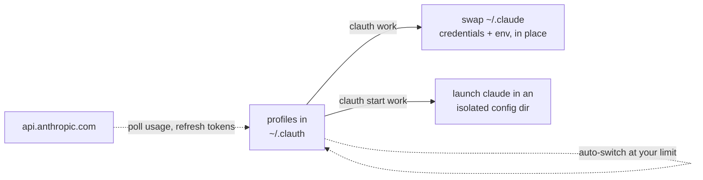

<p align="center">
    
</p>

<h1 align="center">clauth: Claude Code Account Switcher & Usage Monitor</h1>

<p align="center">
  <a href="https://github.com/uwuclxdy/clauth/actions/workflows/release.yml"></a>
  <a href="https://crates.io/crates/clauth"></a>
  <a href="https://github.com/uwuclxdy/clauth/releases"></a>
  
  <a href="LICENSE"></a>
</p>

<p align="center">
  <a href="#how-it-works">How it works</a> ·
  <a href="#installation">Install</a> ·
  <a href="#features">Features</a> ·
  <a href="#quickstart">Quickstart</a> ·
  <a href="#keys">Keys</a> ·
  <a href="#automatic-account-switching">Auto-switch</a> ·
  <a href="#claude-code-plugin">Plugin</a> ·
  <a href="#alternatives">Alternatives</a> ·
  <a href="#faq">FAQ</a> ·
  <a href="#security">Security</a>
</p>

**clauth** is a terminal UI to **switch between multiple Claude Code accounts** without logging out, and a live **Claude Code usage monitor**. It handles Claude Pro, Max, Team, and Enterprise OAuth accounts plus custom API endpoints, hops to a fallback account when you hit the 5-hour limit, and runs parallel Claude Code sessions under different accounts. Linux, macOS, Windows.

- 🔄 **Switch** accounts with one keypress, or `clauth <name>` from the shell
- 📊 **Monitor** live 5h / 7d usage bars, a global token dashboard, and API-equivalent cost
- 🤖 **Auto-switch** to the next account in a fallback chain when you run out of budget
- 🧩 **Parallel** sessions: run several accounts at once in isolated config dirs


> Font is kinda off on the recording, I promise it looks better than this.

## How it works

Claude Code stores its session in `~/.claude/.credentials.json` (OAuth tokens) and the `env` block of `~/.claude/settings.json` (base URL, API key). clauth keeps a per-profile snapshot of both. A switch swaps those two in place and leaves the rest of `~/.claude/` untouched. `clauth start` takes a different route: it launches `claude` against a temporary `~/.claude` mirror, so several accounts run at once.



## Installation

Supported platforms: Linux, macOS, Windows (Git Bash / MSYS2).

**Via cargo** (recommended):

```bash
cargo install clauth
```

**Via install script** (no Rust toolchain required; `--nocargo` forces a binary download):

```bash
curl -fsSL https://raw.githubusercontent.com/uwuclxdy/clauth/mommy/install.sh | bash
```

**Build from source:**

```bash
git clone https://github.com/uwuclxdy/clauth
cd clauth
cargo build --release
# binary at ./target/release/clauth
```

Binary installs update themselves in the background; cargo installs upgrade with `cargo install clauth`. Every install and update path verifies a checksum and a signature before it runs, and `CLAUTH_NO_UPDATE=1` turns updates off. Details in [SECURITY.md](SECURITY.md).

On first launch, clauth offers to install shell completions. It asks before touching your shell rc, and `CLAUTH_NO_COMPLETIONS=1` skips it. Re-run any time with `clauth completions install [shell]`.

## Features

### Switch accounts

- **One-key switching**: pick a profile, <kbd>⏎</kbd>, confirm. Or `clauth <profile>` straight from the shell.
- **Account-change detection**: if Claude Code signed into a different account while clauth was closed, you get a `[Y/n]` prompt before stored tokens are overwritten.
- **Non-destructive**: a switch touches only the API keys and the profile's declared `env` block in `settings.json`. Nothing else moves.
- **Isolated launch**: `clauth start [--isolated] <profile> [claude args...]` runs `claude` in a per-profile `CLAUDE_CONFIG_DIR` (symlink mirror; copies on Windows without symlink privilege), so account identity and billing caches never leak between profiles. Add `--isolated` for a clean session that keeps the account's auth but drops your global `CLAUDE.md` memory, plugins, and hooks — for headless or blind runs (run it in an empty directory to also skip project memory).
- **Status-line aware**: `clauth which [--json]` prints which profile owns the loaded `credentials.json`.
- **Shell completions**: `clauth completions install [shell]` wires up bash, zsh, or fish.

### Monitor usage

- **Live usage bars**: 5h utilization from the Anthropic API on a configurable interval (default 90 s), color-coded with the next reset time. Max accounts also get a 7-day bar.
- **Per-account breakdown**: the Usage tab lays out every window (5h, 7d, 7d sonnet, 7d opus, paid extra-usage spend) plus endpoint, fallback threshold, and merged env keys.
- **Per-row activity**: a countdown to the next refresh, or a color-coded spinner (sapphire fetch, cyan token refresh, green auto-start).
- **Plan detection**: Pro, Max (5x / 20x), Team, Enterprise, identified via `/api/oauth/profile`.
- **Stale-data cues**: an account name underlines yellow when served from cache, red when there's no data.
- **Token usage dashboard**: the Tokens tab reads Claude Code's own token history (the stats cache, topped up from live session transcripts). It rolls that into per-model totals with a today panel, daily peak, busiest hour, and usage sparklines. Press <kbd>c</kbd> to count cache reads/writes in the totals; models past 1M tokens break out on their own.
- **API-equivalent cost**: the Tokens tab prices your recorded usage at live pay-as-you-go API rates, i.e. what those same tokens would cost on the API. Rates come from LiteLLM's price feed and are disk-cached, computed per model (families differ up to 10×) and cache-aware (reads and writes priced at their own rates). Cost shows on the today and total cards, the per-model detail, and the top-models bars. It stays blank until rates load.
- **Claude status feed**: the Status tab pulls live incidents from status.claude.com, with per-component health (claude.ai, API, Claude Code, Cowork), severity, and timeline, cached to disk.
- **Integration health**: the Plugin tab checks that clauth is wired into Claude Code — `clauth` on PATH, the `mcpServers` entry or plugin install, and `claude --version` — alongside each profile's runtime state, and offers one-key fixes for the writes clauth can safely make itself (wire `mcpServers`, repair a diverged credential link). Plugin install stays guided.

### Automate & stay safe

- **Automatic token refresh**: OAuth refresh tokens are single-use, so rotation stays lazy. A stale access token rotates the moment a usage query 401s, never ahead of time. <kbd>t</kbd> force-rotates every account.
- **Auto-switch on exhaustion**: opt accounts into an ordered fallback chain. When the active one crosses its 5h threshold (95% default), clauth hops to the next member with headroom. Needs clauth open.
- **Multi-instance safe**: state writes serialize through a file lock, each instance reloads on external changes, and HTTP runs off the UI thread.
- **In-app help**: <kbd>?</kbd> opens a keybinding reference scoped to the current tab.

## Quickstart

Capture your current Claude Code session as a profile:

```bash
clauth
# Select "+ new from current profile", enter a name, e.g. "work"
```

Repeat while logged in to a different account, then switch in the TUI (<kbd>⏎</kbd> + confirm) or directly by name:

```bash
clauth work
# switched to 'work'
```

Run claude under a profile without touching the global config:

```bash
clauth start personal -- --model haiku
# spawns claude with personal's credentials in a per-profile CLAUDE_CONFIG_DIR
```

For a clean, blind session — auth only, no global memory, plugins, or hooks:

```bash
clauth start --isolated personal -p < prompt.txt
# pass the prompt on stdin: a variadic claude flag (e.g. --disallowedTools a,b,c)
# would otherwise swallow a trailing positional prompt forwarded through clauth
```

The active profile shows in orange. Usage bars are cached locally, so they stay on screen even when the Anthropic API is rate-limited or offline. <kbd>←</kbd> <kbd>→</kbd> move between the eight tabs:

| Tab | What it holds |
|-----|---------------|
| **Overview** | switch and reorder accounts |
| **Usage** | per-account window breakdown |
| **Tokens** | global Claude Code token stats + API-equivalent cost across all models |
| **Setup** | endpoint, key, env, auto-start |
| **Fallback** | chain editor |
| **Config** | theme, refresh interval, wrap-off, divergence default |
| **Status** | Claude incident feed |
| **Plugin** | Claude Code integration health + per-profile runtime, with one-key fixes |

> [!TIP]
> Dev-only: `cargo test showcase -- --ignored --nocapture` runs the real interactive TUI on fake data against a throwaway home dir (never built into the binary, no network). Handy for screenshots.

## Keys

Keys are scoped to the current tab; <kbd>?</kbd> lists every binding for the tab you're on.

| Keys | Action |
|------|--------|
| <kbd>←</kbd> <kbd>→</kbd> | move between tabs |
| <kbd>↑</kbd> <kbd>↓</kbd> | move the selection |
| <kbd>⏎</kbd> | switch to the selected profile, or confirm an edit |
| <kbd>t</kbd> | force-refresh every account's token now |
| <kbd>+</kbd> <kbd>-</kbd> | nudge the selected threshold or interval |
| <kbd>c</kbd> | Tokens tab: count cache reads/writes in the totals |
| <kbd>p</kbd> | Usage tab: toggle the ideal-pace marker |
| <kbd>f</kbd> | Plugin tab: apply the selected row's fix |
| <kbd>?</kbd> | full keybinding help for the current tab |

## Profile types

**Claude Pro / Max / Team / Enterprise (OAuth):** leave the base URL blank. clauth captures the OAuth token from your running session, restores it on switch, and detects the plan tier for you.

**API endpoint:** set a base URL and, optionally, an API key. Works with the official Anthropic API or any compatible proxy. Edit the URL or key any time without losing stored credentials.

## Claude Code plugin

clauth ships a plugin that exposes your profiles to a live Claude Code session via MCP. Add this repo as a plugin marketplace in Claude Code, then install the `clauth` plugin:

```
/plugin marketplace add uwuclxdy/clauth
/plugin install clauth@clauth
```

Claude Code launches `clauth mcp` in the background for the session's lifetime; `clauth` must be on `PATH` (it already is after any standard install).

Once active, Claude Code can call four tools:

| Tool | What it does | Quota |
|------|--------------|-------|
| `list_profiles` | All profiles with cached 5h/7d usage %, provider, active flag, live-session flag, observed per-model throughput | zero (disk cache) |
| `which` | Which profile owns the current session (+ its observed throughput) | zero (filesystem) |
| `switch` | Relink the global active profile to another name | zero (no prime) |
| `run` | Delegate a headless prompt to another profile and return the answer | **real usage window on the target account** |

**Caveats to know:**

- `switch` relinks the global `~/.claude` credentials. A `clauth start` session runs against its own profile and is unaffected; a session on the global credentials adopts the new profile on its next token refresh, so it changes the running account mid-session. To reach another profile without disturbing the current session, use `run`.
- `run` burns a real 5h usage window on the target account. It is hard-capped at recursion depth 1, so a delegated session cannot call `run` again.
- `run` accepts `cwd`, `env`, `args`, `timeout_secs` (default 300, max 3600), and `isolated` (a clean delegate with no operator memory, plugins, or hooks). clauth records the delegate's observed tokens/sec per model and flags a model as degraded or recently rate-limited in `list_profiles` / `which` — the only throughput signal available, since subscription throttle is per-model and absent from the usage snapshot.

## Auto-starting the 5-hour timer

The 5-hour usage window only starts after a real inference call. The OAuth refresh clauth runs at launch doesn't trigger it. To arm a profile's timer at startup, toggle auto-start on the **Setup** tab, or set it in `~/.clauth/profiles/<name>/config.toml`:

```toml
auto_start = true
```

When enabled, clauth sends a tiny Haiku ping (`max_tokens = 1`, fractions of a cent) on launch and on each refresh tick while no window is running. On a cold start it fetches usage before the first ping, so it never fires blind over a window that might already be live. The timer can arm one tick late as a result. Default off, OAuth profiles only. The older field name `kick_timer = true` still works on read.

> [!IMPORTANT]
> The ping is a real, billed `/v1/messages` call under your own OAuth token, the same request Claude Code fires on startup (see [what acts on your behalf](SECURITY.md#what-acts-on-your-behalf)). Leave auto-start off if you'd rather only the live `claude` process open a window.

## Automatic account switching

The **Fallback** tab holds an ordered chain of profiles that clauth hops between when one runs out of 5-hour budget:

- Each member has its own threshold (5h utilization %, default 95%); edit inline (<kbd>+</kbd> / <kbd>-</kbd> or type).
- After each usage refresh (at startup and on every tick), clauth checks the active profile. If it's a chain member at or above its threshold, clauth walks the chain (wrapping) and switches to the first member under its own threshold. The `◆` marker shifts in place.
- A **100%** threshold marks a last-resort sink: chosen only when every other member is past its threshold. Claude Code then surfaces its own *"out of 5h limit"* message after the switch lands.
- The chain-global **wrap-off** toggle (Config tab) decides what happens when everyone is exhausted and no sink exists: off keeps you on the last account; on switches off all accounts, then re-arms once any member drops back under its threshold.
- No eligible target keeps clauth put. If the active profile isn't in the chain, auto-switch is disabled. Profiles outside the chain are never switched away from or to. It's opt-in.

Configuration lives in `~/.clauth/profiles.toml` (`fallback_chain`, ordered) and per-profile `config.toml` (`fallback_threshold`); both are safe to hand-edit.

## Alternatives

Most tools do one half. clauth does both in one TUI: switching and live usage, tied together by the auto-switch chain.

| Tool | What it does | Compared to clauth |
|------|--------------|--------------------|
| [claude-swap](https://github.com/realiti4/claude-swap) | CLI account switcher (token backup/restore) | no usage view, no auto-switch |
| [CCSwitcher](https://github.com/XueshiQiao/CCSwitcher), [claude-account-switcher](https://github.com/Symbioose/claude-account-switcher) | macOS menu-bar switchers | macOS-only, no fallback chain |
| [cc-account-switcher](https://github.com/ming86/cc-account-switcher) | credential-swap scripts | no TUI, no usage |
| [Claude-Code-Usage-Monitor](https://github.com/Maciek-roboblog/Claude-Code-Usage-Monitor) | real-time usage monitor with predictions | monitoring only, single account |
| [claude-code-statusline](https://github.com/ohugonnot/claude-code-statusline) | rate-limit status line inside Claude Code | in-session display, no switching |
| `CLAUDE_CONFIG_DIR` by hand | manual per-account config dirs | what `clauth start` automates |

## FAQ

**How do I switch between multiple Claude Code accounts without logging out?**
Install clauth, save each logged-in session as a profile once, then switch with `clauth <name>` or a single keypress in the TUI. No browser, no re-login.

**Can I run Claude Code with multiple accounts at the same time?**
Yes. `clauth start <profile>` launches `claude` in an isolated `CLAUDE_CONFIG_DIR`, so parallel sessions don't share identity, settings, or billing caches.

**How do I run Claude Code without my global `CLAUDE.md`, plugins, or hooks?**
`clauth start --isolated <profile>` keeps the account's auth but drops your operator memory, plugins, and hooks — a clean session for headless work or blind evals. Run it in an empty directory to skip project memory too. The same is available on the MCP `run` tool via `isolated: true`.

**Can Claude Code switch accounts automatically when I hit the 5-hour limit?**
With clauth open, yes: put accounts in the fallback chain and clauth switches to the next member with headroom the moment the active one crosses its threshold.

**How do I monitor Claude Code usage and rate limits?**
The Overview tab shows color-coded 5h (and 7-day) bars per account with reset times; the Usage tab breaks down every rate-limit window the API reports; the Tokens tab adds a global token dashboard with API-equivalent cost.

**Does it work with Claude Pro, Max, Team, and Enterprise?**
Yes. OAuth profiles cover all paid tiers (plan auto-detected, including Max 5x / 20x). API-endpoint profiles cover the Anthropic API or any compatible proxy.

**Where does clauth store my Claude Code credentials?**
Locally under `~/.clauth/`, with `0600` permissions on Unix. Tokens only ever go to Anthropic. See [SECURITY.md](SECURITY.md) for the full breakdown.

<details>
<summary><b>Storage layout</b>: what clauth writes under <code>~/.clauth/</code></summary>

```
~/.clauth/
  profiles.toml          # profile order, active marker, fallback chain, wrap-off, theme, refresh interval
  price_cache.json       # cached model price table (LiteLLM rates) for the Tokens cost lens
  status_cache.json      # cached Claude status incident feed
  profiles/
    work/
      config.toml        # base_url, api_key, auto_start, fallback_threshold, [env]
      credentials.json   # OAuth token snapshot (credentials.json.pending while a rotation is mid-write)
      usage_cache.json   # last known utilization + plan info
      runtime/           # per-profile CLAUDE_CONFIG_DIR tree for `clauth start`
      runtime-isolated/  # same, for `clauth start --isolated` (no operator memory/plugins/hooks)
      sessions/          # per-session PID files (ref-counting live launches)
      sessions-isolated/ # per-session PID files for isolated launches
      throughput_cache.json  # observed delegate tok/s + rate-limit hits per model
    personal/
      ...
```

</details>

## Security

clauth handles live OAuth tokens and replaces its own binary over the network, so [SECURITY.md](SECURITY.md) lays out the trust model: where credentials live, every host clauth contacts, how updates get verified, and how to switch each behavior off. Found something exploitable? Report it privately through the repo's **Security → Report a vulnerability**.

## License

MIT
