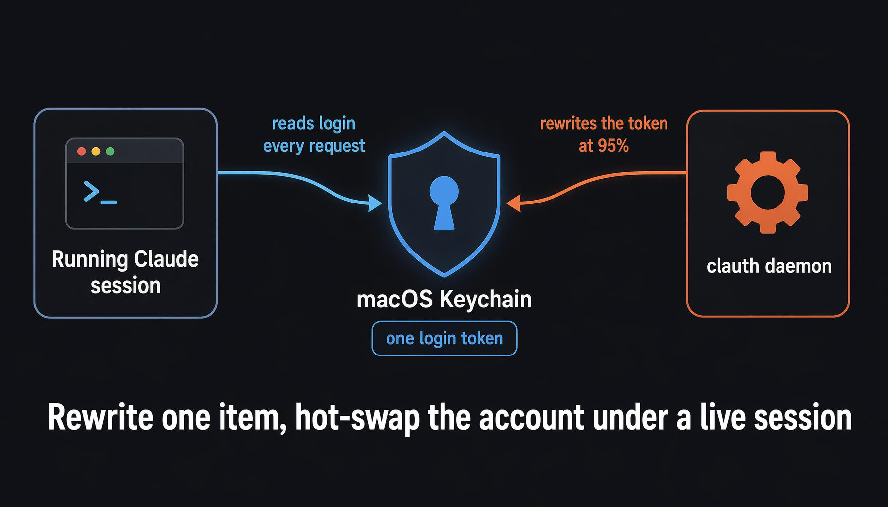

<p align="center">
    
</p>

<h1 align="center">Claude Code multi-account manager & MCP Plugin</h1>

<p align="center">
  <a href="https://github.com/xingfanxia/clauth/actions/workflows/ci.yml"></a>
  
  <a href="LICENSE"></a>
</p>

<p align="center"><em>macOS-focused fork — real Keychain account switching, browser-OAuth login, and a headless auto-switch daemon + <code>status.json</code> feed for a menu-bar app. Forked from the upstream <code>clauth</code> TUI (see the <code>upstream</code> git remote and LICENSE).</em></p>

<p align="center">
  <a href="#features">Features</a> ·
  <a href="#how-it-works">How it works</a> ·
  <a href="#install">Install</a> ·
  <a href="#quickstart">Quickstart</a> ·
  <a href="#claude-code-plugin">Plugin</a> ·
  <a href="#alternatives">Alternatives</a> ·
  <a href="#faq">FAQ</a> ·
  <a href="https://github.com/uwuclxdy/clauth/wiki">Wiki</a>
</p>

**Juggle every Claude Code account from one terminal: switch in a keypress, track live 5h / 7d usage, auto-switch before a limit stops you, even hand a task to another account from inside Claude.**

Most account tools do one half. clauth pairs instant **switching between multiple Claude Code accounts** with a live **usage monitor**, then wires the two together so a fallback chain moves you off an exhausted account before Claude Code ever blocks. Works with Claude Pro, Max, Team, Enterprise OAuth accounts or any custom API endpoint. Linux, macOS, Windows.


### The signature move: hot-swap a login under a live session

On macOS this fork's headline trick rests on one non-obvious fact: a running
`claude` re-reads its login from **one macOS Keychain item** (`Claude Code-credentials`)
on *every request*. So rewriting that one item hot-swaps the active account
underneath a live session — no restart, no re-login. The `clauth daemon` does it
automatically when the active account's 5-hour window fills:

<p align="center">
  
</p>

<p align="center">
  
</p>

Pair it with **[ccsbar](https://github.com/xingfanxia/ccsbar)** (Claude Code
Switcher Bar), the native menu-bar companion that reads this daemon's
`status.json` feed and makes the next switch visible before it fires. Full
write-up: [I Taught My Claude Accounts to Rotate Themselves](https://blog.ax0x.ai/hot-swapping-claude-logins).

> Font is kinda off on the recording, I promise it looks better than this.

## Features

- 🔄 **Switch** accounts in one keypress or `clauth <name>`: OAuth (Pro / Max / Team / Enterprise) or a custom API endpoint, plan tier detected for you
- 📊 **Monitor** live 5h / 7d rate-limit bars, a global token dashboard with API-equivalent cost, plus a live Claude status-incident feed
- 🤖 **Auto-switch** down a fallback chain the moment an account hits its limit, with weekly-window and spend-ceiling gates so a long run never stalls and never surprises you with a bill. Opted-in accounts queue their auto-start, opening 5h windows `5h / accounts` apart instead of all at once
- 🧩 **Run in parallel**: several accounts at once in isolated config dirs, or a clean headless session with none of your global memory, plugins, or hooks
- 🔌 **From inside Claude**: an MCP plugin lets a live session list, switch, or delegate a whole prompt (even headless) to another account, and tells a session when the account behind it changed
- 🖥️ **Headless**: `clauth daemon` runs the refresh and auto-switch loop with no TUI and publishes `status.json` for a menu-bar app to read, or serves that feed and the account switch to another machine over HTTPS with `--listen`
- 🔀 **Codex too**: adopt or mint a ChatGPT login as a codex profile, run `codex` under it in its own `CODEX_HOME`, and let a separate codex chain rotate accounts between sessions ([Codex](https://github.com/uwuclxdy/clauth/wiki/Codex))
- 🛠️ **Quality-of-life**: browse and resume past sessions under any account, per-profile model routing, `start --auto` to pick the account by the models a session will run, shell completions, signed self-updates, multi-instance safe

Full reference: **[the wiki](https://github.com/uwuclxdy/clauth/wiki)**.

### Fork additions

Everything above is upstream clauth. This fork ([`xingfanxia/clauth`](https://github.com/xingfanxia/clauth)) adds, on macOS:

- **Codex accounts.** `clauth login <profile> --codex` captures the live `~/.codex/auth.json` (OpenAI Codex CLI) into a codex profile, `--codex --browser` mints a fresh codex login through codex's own PKCE flow, and `--new` refuses to touch an existing profile. `clauth <profile>` switches codex accounts with the same verb, `clauth start <codex-profile>` runs `codex` in that profile's isolated `CODEX_HOME`, and `clauth fallback add <codex-profile>` builds a codex auto-switch chain independent of the claude one. `clauth use-reset <codex-profile>` spends one of the account's banked usage-limit resets after a `[y/N]` (`--list` shows them and spends nothing), the same reset codex's own `/usage` menu offers. Design notes: `docs/codex-support/`.
- **Injection proxy.** `clauth proxy [--port N]` is an opt-in loopback proxy for codex (`clauth proxy --print-config` prints the provider block to paste): it swaps in the selected account's identity, forwards to `chatgpt.com`, and on a 429 rotates to the next account and replays before codex sees a byte.
- **`clauth doctor`.** A read-only health check of the daemon and the macOS wiring: `status.json` freshness and schema, the daemon lock, the control socket, the LaunchAgent, the binary's code signature, the Keychain write grant, the codex login and the proxy.
- **Daemon control socket.** `~/.clauth/clauthd.sock` takes newline-delimited JSON, one command per connection: `snapshot`, `switch`, `refresh`, `fallback_add`, `fallback_remove`, `fallback_move`, `set_threshold`, `set_last_resort`, `set_member_weekly` (`null` clears), `set_check_weekly`, `set_check_scoped`, `set_wrap_off`, `set_weekly_threshold`, `rename`. Every command only enqueues, so `ok` means accepted; `status.json` shows it land.
- **`tokens.json` feed.** Beside `status.json` the daemon publishes `~/.clauth/tokens.json`: machine-wide token counts and API-equivalent cost across every account, for the menu bar. No token values, no credentials.
- **Fork-only `status.json` fields.** `harness`, `account_email`, the codex fields, the daemon's next-move `forecast`, `burn_aware` and the rest of the additive set are specified in [docs/ccsbar/DESIGN.md](docs/ccsbar/DESIGN.md), the contract the menu-bar clients ([ccsbar](https://github.com/xingfanxia/ccsbar), Pulse) read.
- **No self-update.** The upstream updater is compiled out (`FORK_BUILD` in `src/update.rs`), so the signed self-updates above do not apply here: rebuild from source to upgrade. See [Install](#install).

## How it works

Claude Code stores its session in `~/.claude/.credentials.json` (OAuth tokens) and the `env` block of `~/.claude/settings.json` (base URL, API key). clauth keeps a per-profile snapshot of both. A switch swaps those two in place and leaves the rest of `~/.claude/` untouched. `clauth start` takes a different route: it launches `claude` against a temporary `~/.claude` mirror, so several accounts run at once.

## Install

This fork targets **macOS** (the Keychain switching, browser-OAuth login, and daemon are macOS features). It ships **no prebuilt release binaries** and is **not** published to crates.io under this name, so build it from source. Do **not** run `cargo install clauth`: that pulls the upstream crate without any of the fork's features.

```bash
git clone https://github.com/xingfanxia/clauth
cd clauth
./install.sh          # cargo install --path . --locked  → ~/.cargo/bin/clauth
```

Or build without installing:

```bash
cargo build --release   # binary at ./target/release/clauth
```

The macOS auto-switch daemon installs as a login LaunchAgent:

```bash
dist/macos/daemon-install.sh
```

This fork's binary does **not** self-update: it has no release pipeline, and the upstream self-updater is compiled out so it can never replace the fork with an upstream build. Rebuild from source to upgrade; details in [SECURITY.md](SECURITY.md). On first launch clauth offers to install shell completions, asking before it touches your shell rc. More: [Install](https://github.com/uwuclxdy/clauth/wiki/Install).

## Quickstart

Capture your current Claude Code login as a profile:

```bash
clauth capture work
```

or in the TUI: `clauth`, Setup tab, `+ new`, then the `+ capture current login` row.

Repeat while logged in to a different account, then switch in the TUI (<kbd>⏎</kbd> + confirm) or directly by name:

```bash
clauth work
# switched to 'work'
```

Run claude under a profile without touching the global config:

```bash
clauth start personal -- --model haiku
# spawns claude with personal's credentials in a per-profile CLAUDE_CONFIG_DIR
```

For a clean, blind session (auth only, no global memory, plugins, or hooks):

```bash
clauth start --isolated personal -p < prompt.txt
# pass the prompt on stdin: a variadic claude flag (e.g. --disallowedTools a,b,c)
# would otherwise swallow a trailing positional prompt forwarded through clauth
```

| Command | Does |
|---------|------|
| `clauth` | open the TUI |
| `clauth <profile>` | switch and exit |
| `clauth start <profile>` | run `claude` under that account, in its own config dir |
| `clauth login <profile>` | add or re-authenticate an account, browser or API key; the browser login also takes a code from a link opened on any device (ssh, no browser) |
| `clauth list` / `clauth which` | account table with cached usage / who owns this session |
| `clauth sessions`, `resume`, `info` | browse past Claude Code sessions and resume one anywhere |
| `clauth daemon` | headless refresh + auto-switch loop, optionally serving the REST API (`--listen`) |

Every command and flag: [Quickstart](https://github.com/uwuclxdy/clauth/wiki/Quickstart#commands).

The active profile shows in orange. Usage bars are cached locally, so they stay on screen even when the Anthropic API is rate-limited or offline. <kbd>←</kbd> <kbd>→</kbd> move between the eight tabs, <kbd>?</kbd> lists the keys for the tab you are on.

| Tab | What it holds |
|-----|---------------|
| **Overview** | switch and reorder accounts |
| **Usage** | per-account window breakdown |
| **Tokens** | global Claude Code token stats + API-equivalent cost across all models |
| **Setup** | endpoint, key, env, auto-start, per-profile model routing, account presets |
| **Fallback** | chain editor |
| **Config** | appearance, scheduler, auto-switch defaults |
| **Status** | Claude incident feed |
| **Plugin** | Claude Code wiring + per-profile runtime, with one-key fixes |

## Claude Code plugin

clauth ships a plugin that exposes your profiles to a live Claude Code session via MCP. Install it from the TUI: Plugin tab, `plugin` row, <kbd>f</kbd>, confirm. That drives Claude Code's own installer against a plugin tree clauth materializes locally, so there is nothing to add by hand. `/plugin marketplace add xingfanxia/clauth` then `/plugin install clauth@clauth` works too; it registers the same plugin against this repo instead, and clauth re-points it at the local tree the next time it runs. Either way the plugin's tools are `clauth mcp`, so the binary has to be on your `PATH`.

A registration that breaks repairs itself: `clauth mcp` heals one at startup, so does the daemon's tick, and `clauth start` heals one before `claude` launches. That last one covers what a hook cannot, since a marketplace too broken to load means the plugin never loads and its hooks never fire.

| Tool | What it does | Quota |
|------|--------------|-------|
| `profiles` | every account with cached 5h/7d usage, provider, tier, live-session flag, observed throughput, and the account states worth a look before spending (disabled and no api key, both of which refuse a delegate; login expired, which refuses one except on an account that runs its own endpoint with its own key; a canceled subscription, which never refuses); `scope: "session"` names the account this session runs on | zero (disk cache) |
| `switch_profile` | relink the global active profile; the reply says what it does to this session | zero |
| `delegate` | hand a headless prompt to another account and return the answer (or a `job_id`) | **real usage window on the target account** |
| `monitor` | check, collect or wait on backgrounded delegates' results, or wait on clauth's state (active profile, its usage cache, the credentials file) | zero (filesystem) |

`delegate` fields, kill and resume rules, the manual `mcpServers` entry: [Claude Code plugin](https://github.com/uwuclxdy/clauth/wiki/Claude-Code-Plugin).

## Alternatives

clauth is the only one of these that pairs account switching with a live usage monitor and ties them together with an auto-switch chain, in a single TUI.

| Tool | What it does | Compared to clauth |
|------|--------------|--------------------|
| [claude-swap](https://github.com/realiti4/claude-swap) | CLI account switcher (token backup/restore) | no usage view, no auto-switch |
| [CCSwitcher](https://github.com/XueshiQiao/CCSwitcher), [claude-account-switcher](https://github.com/Symbioose/claude-account-switcher) | macOS menu-bar switchers | macOS-only, no fallback chain |
| [cc-account-switcher](https://github.com/ming86/cc-account-switcher) | credential-swap scripts | no TUI, no usage |
| [Claude-Code-Usage-Monitor](https://github.com/Maciek-roboblog/Claude-Code-Usage-Monitor) | real-time usage monitor with predictions | monitoring only, single account |
| [claude-code-statusline](https://github.com/ohugonnot/claude-code-statusline) | rate-limit status line inside Claude Code | in-session display, no switching |
| `CLAUDE_CONFIG_DIR` by hand | manual per-account config dirs | what `clauth start` automates |

## FAQ

**How do I switch between multiple Claude Code accounts without logging out?** Install clauth, save each logged-in session as a profile once, then switch with `clauth <name>` or a single keypress in the TUI. No browser, no re-login.

**Can I run Claude Code with multiple accounts at the same time?** Yes. `clauth start <profile>` launches `claude` in an isolated `CLAUDE_CONFIG_DIR`, so parallel sessions don't share identity, settings, or billing caches.

**How do I run Claude Code without my global `CLAUDE.md`, plugins, or hooks?** `clauth start --isolated <profile>` keeps the account's auth but drops your `CLAUDE.md`, plugins, hooks, skills, MCP servers and tools, leaving a clean session for headless work or blind evals. The MCP `delegate` tool takes `isolated: true` for the same thing.

**Can Claude Code switch accounts automatically when I hit the 5-hour limit?** Yes: put accounts in the fallback chain and clauth switches to the next member with headroom the moment the active one crosses its threshold. It runs in the TUI or headless via `clauth daemon`.

**Is there a Claude Code MCP server / plugin to switch accounts from inside a chat?** Yes. clauth ships a plugin that runs as an MCP server (`clauth mcp`), so a live session can list accounts, `switch_profile`, or `delegate` a headless prompt to another account without leaving the chat.

**How do I monitor Claude Code usage and rate limits?** The Overview tab shows color-coded 5h (and 7-day) bars per account with reset times; the Usage tab breaks down every rate-limit window the API reports; the Tokens tab adds a global token dashboard with API-equivalent cost.

**Does it work with Claude Pro, Max, Team, and Enterprise?** Yes. OAuth profiles cover all paid tiers (plan auto-detected, including Max 5x / 20x). API-endpoint profiles cover the Anthropic API or any compatible proxy.

**Where does clauth store my Claude Code credentials?** Locally under `~/.clauth/`, with `0600` permissions on Unix. Claude tokens only ever go to Anthropic, codex tokens only to OpenAI. See [SECURITY.md](SECURITY.md).

More, including what to check when something misbehaves: [FAQ](https://github.com/uwuclxdy/clauth/wiki/FAQ).

## Documentation

| Page | Covers |
|------|--------|
| [Install](https://github.com/uwuclxdy/clauth/wiki/Install) | every install path, update verification, completions |
| [Quickstart](https://github.com/uwuclxdy/clauth/wiki/Quickstart) | first run, every command, flag, and env var |
| [Interface and keys](https://github.com/uwuclxdy/clauth/wiki/Interface-And-Keys) | the eight tabs, every keybinding, the action menus |
| [Configuration](https://github.com/uwuclxdy/clauth/wiki/Configuration) | both TOML files key by key, model routing, storage layout |
| [Auto-switch](https://github.com/uwuclxdy/clauth/wiki/Auto-Switch) | thresholds, exclusion rules, burn-aware mode, spend ceilings |
| [Daemon](https://github.com/uwuclxdy/clauth/wiki/Daemon) | `clauth daemon`, the REST API, and the `status.json` read contract |
| [Claude Code plugin](https://github.com/uwuclxdy/clauth/wiki/Claude-Code-Plugin) | the MCP server and `delegate` in full |
| [herdr plugin](https://github.com/uwuclxdy/clauth/wiki/Herdr-Plugin) | the clauth popup in herdr, the key, the per-pane account tag |
| [Tokens and cost](https://github.com/uwuclxdy/clauth/wiki/Tokens-And-Cost) | where the dashboard reads from, what the cost figure means |
| [Codex](https://github.com/uwuclxdy/clauth/wiki/Codex) | ChatGPT logins as codex profiles: capture, sessions, the codex chain |
| [Security](https://github.com/uwuclxdy/clauth/wiki/Security) | where credentials live and how they move |

## Development

```bash
cargo build --release
cargo clippy --all-targets
cargo test
```

CI gates `fmt --check`, `clippy -D warnings`, the test suite, `cargo-deny` and `cargo audit` on every push to `mommy` and every pull request; a doc-only change is skipped.

> [!TIP] `cargo test showcase -- --ignored --nocapture` drives the real interactive TUI on fake data against a throwaway home dir (no network, never compiled into the binary). Handy for screenshots.

## Security

clauth handles live OAuth tokens and replaces its own binary over the network, so [SECURITY.md](SECURITY.md) lays out the trust model: where credentials live, every host clauth contacts, how updates get verified, and how to switch each behavior off. Found something exploitable? Report it privately through the repo's **Security → Report a vulnerability**.

## License

MIT
